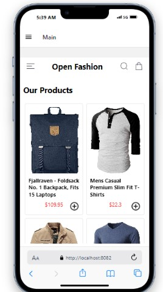
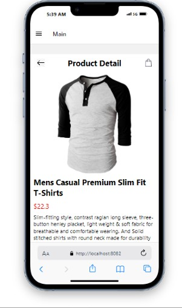
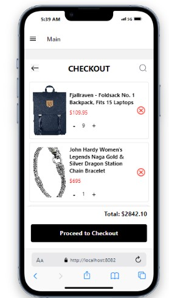

# rn-assignment7-11126125

This is a React Native e-commerce app that allows users to browse products, view product details, add/remove products from their cart, and view their cart contents. The app fetches data from an external API and stores selected items locally on the device using Local Storage.

# HomeScreen
Displays a list of available products fetched from the external API.
Each product item includes an "Add to Cart" button.

# ProductDetailScreen
Displays detailed information about a selected product.
Includes a "Back" button to return to the HomeScreen.

# CartScreen
Displays a list of products added to the cart.
Each cart item includes a "Remove from Cart" button.

# Drawer Component/Navigation Menu
Accessible through a swipe gesture or button.
Provides navigation to the HomeScreen, CartScreen, and other app features.
Features

# Product List and Details
Fetches product data from an external API using fetch or axios.
Manages asynchronous operations with async/await or promises.
Renders product lists and details.

# Cart Management
Allows users to add products to their cart.
Allows users to remove products from their cart.
Stores selected items locally on the device using Local Storage (AsyncStorage, SecureStore, or FileSystem).

# Navigation
Provides a drawer component/navigation menu accessible through a swipe gesture or button.

# Functionality
Users can view a list of available products from the external API.
Users can preview detailed information about a product.
Users can add products to their cart.
Users can remove products from their cart.
Users can view the items in their cart.

# Technical Requirements
React Native
External API for product data
Local Storage 

# Screenshot
Home screen()
Product screen()
Cart screen() 